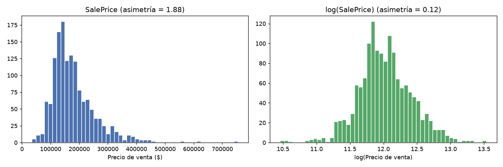
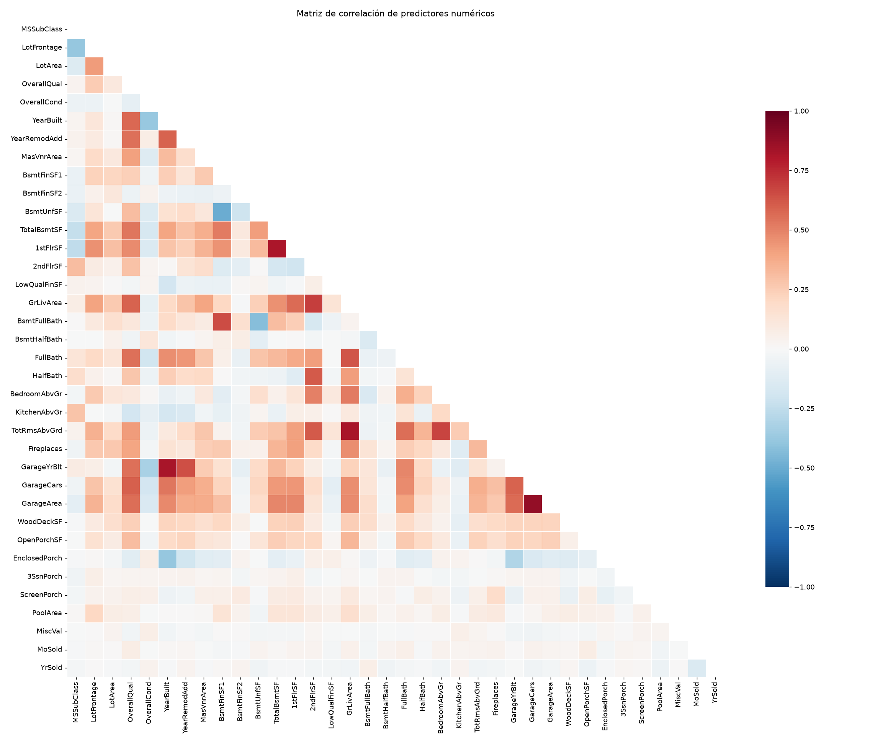

# Informe TP1 — Regresión Lineal Multivariable (Ejercicio 1)

**Dataset:** *House Prices — Advanced Regression Techniques* (Kaggle).
**Archivo:** `train.csv` con **1460 filas y 81 columnas** (detalle en la sección 1).

Este informe se redacta por partes según la consigna. Cada sección se completa a medida que
se resuelve cada ítem.

---

## Identificación de variables (según consigna)

- **(a) Variable respuesta:** `SalePrice` (precio de venta de la vivienda, numérica continua).
  - El enunciado permite usar el precio o una transformación de este (p. ej. `log(SalePrice)`),
    que se decide más abajo en el análisis exploratorio.
- **(b) Predictores numéricos continuos** (ejemplos relevantes): `LotArea`, `GrLivArea`
  (superficie habitable), `TotalBsmtSF`, `1stFlrSF`, `2ndFlrSF`, `LotFrontage`, `YearBuilt`,
  `YearRemodAdd`, así como puntajes de calidad ordinal (`OverallQual`, `OverallCond`).
- **(c) Predictores binarios (0/1):** en el dataset la presencia/ausencia suele estar codificada
  como categóricas (`CentralAir` Y/N, `PavedDrive` Y/N/P), o en columnas numéricas que actúan como
  indicadores (p. ej. `GarageCars`). Para el ejercicio se considera el patrón de ejemplo del
  enunciado (garaje / pileta / aire acondicionado).
- **(d) Categóricas con más de 2 niveles:** `Neighborhood` (25 niveles), `MSZoning` (5),
  `HouseStyle` (8), `RoofStyle` (6), `BldgType` (5), `Functional` (7), `SaleType` (9), etc.

> A lo largo de todo el ejercicio se usan estos nombres reales de columnas.

---

## 1. Análisis exploratorio

**Dimensiones del dataset:** `train.csv` tiene **1460 filas y 81 columnas**: 1 variable
respuesta (`SalePrice`), 79 predictores (36 numéricos + 43 categóricos) y la columna `Id`.
El `test.csv` de Kaggle (solo para envío de predicciones) tiene **1459 filas y 80 columnas**
(sin `SalePrice`).

### 1.1 Análisis descriptivo — Variables numéricas

| Variable | Media | Desv. estándar | Min | Q1 | Mediana | Q3 | Max | % missings |
|---|---|---|---|---|---|---|---|---|
| `SalePrice` | 180 921 | 79 442 | 34 900 | 129 975 | 163 000 | 214 000 | 755 000 | 0 % |
| `GrLivArea` | 1 515 | 525 | 334 | 1 129 | 1 464 | 1 777 | 5 642 | 0 % |
| `LotArea` | 10 517 | 9 981 | 1 300 | 7 553 | 9 478 | 11 601 | 215 245 | 0 % |
| `TotalBsmtSF` | 1 057 | 439 | 0 | 796 | 991 | 1 298 | 6 110 | 0 % |
| `1stFlrSF` | 1 163 | 387 | 334 | 882 | 1087 | 1 391 | 4 692 | 0 % |
| `OverallQual` | 6.1 | 1.4 | 1 | 5 | 6 | 7 | 10 | 0 % |
| `YearBuilt` | 1971 | 30 | 1872 | 1954 | 1973 | 2000 | 2010 | 0 % |

**Observaciones generales:**

- Hay **38 variables numéricas** y **43 categóricas**.
- Hay **datos faltantes** en varias columnas: `LotFrontage` (259), `GarageYrBlt` (81),
  `MasVnrArea` (8), además de muchas categorías con NA que representan *"no tiene esa
  característica"* (p. ej. `Alley` con 1369, `PoolQC` con 1453, `MiscFeature` con 1406).
  Estas últimas son NA con significado semántico y deberán tratarse en preparación de datos.
- Varias variables numéricas muestran **asimetría positiva** fuerte: `LotArea` (12.2),
  `PoolArea` (14.8), `MiscVal` (24.5), `3SsnPorch` (10.3), `LowQualFinSF` (9.0), `KitchenAbvGr`
  (4.5), `TotalBsmtSF`-relacionadas, etc. Esto sugiere que **la estandarización será necesaria**
  antes de Ridge/Lasso.

### 1.2 Variables categóricas

La mayoría de las categóricas no tienen faltantes reales. Las categorías predominantes son:

- `Neighborhood` (25 niveles): los más frecuentes `NAmes` (225), `CollgCr` (150), `OldTown` (113).
- `MSZoning` (5): `RL` (1151), `RM` (218), `FV` (65).
- `BldgType` (5): `1Fam` (1220) domina; seguido de `TwnhsE` (114), `Duplex` (52).
- `HouseStyle` (8): `1Story` (726), `2Story` (445), `1.5Fin` (154).
- `RoofStyle` (6): `Gable` (1141), `Hip` (286).

La columna `Neighborhood` concentrará gran parte del poder predictivo y, al tener 25 niveles,
generará **24 variables dummy** en la codificación (k−1). Otras de gran número de niveles:
`Exterior1st` (15), `Exterior2nd` (16).

Algunas categóricas son casi constantes (poco informativas): `Street` (Pave 1454 / Grvl 6),
`Utilities` (AllPub 1459), `Condition2` (Norm 1445), `RoofMatl` (CompShg 1434), `Heating`
(GasA 1428). Candidatas a ser reducidas o eliminadas.

### (c) 1.3 Distribución de la variable respuesta (`SalePrice`)

**Figura 1 — Histograma de `SalePrice` vs. `log(SalePrice)`:**

- **Asimetría (skewness):** `SalePrice` presenta **sesgo positivo (asimétrico a la derecha)**
  de **1.88**. Su **kurtosis** es 6.54, indicando **colas pesadas** con valores atípicos
  (pocas viviendas muy caras).
- El test de normalidad (D'Agostino-Pearson) rechaza la normalidad (p ≈ 1e-33).
- Esto es esperable: precios son concentrados en un rango medio con una cola hacia arriba
  (valores extremos muy caros).
- **Transformación logarítmica:** al aplicar `log(SalePrice)` la asimetría cae a **0.12** y el
  histograma se vuelve prácticamente simétrico (aunque el test sigue rechazando Gaussianidad
  estricta, la escala mejora notablemente).

**¿Convendría trabajar con el logaritmo?**
Sí. Motivación conforme a la teoría (Normalidad, para inferencia):

1. **Normalidad de los errores:** al estabilizar la distribución de la variable respuesta se
   aproxima a que los residuos sean más normales, requisito para la inferencia válida (valores p
   e intervalos de confianza fiables) — ver supuestos de Gauss-Markov.
2. **Estabiliza la varianza (homocedasticidad):** con precios el error absoluto crece con el
   precio; bajo log las variaciones se interpretan en términos relativos (%), reduciendo la
   heterocedasticidad.
3. **Efecto multiplicativo más realista:** un incremento de $10 000 no pesa igual en una casa de
   $50 000 que en una de $500 000; el log describe mejor el efecto que sobre esta variable.
Como desventaja, los coeficientes y errores se interpretan en términos de **% de cambio del
precio** y el RMSE pasa a medirse en escala logarítmica.

Por lo tanto, se trabajará con **`log(SalePrice)` como variable respuesta** en el resto
del ejercicio.

### 1.4 Matriz de correlación entre predictores numéricos

**Relaciones más fuertes entre predictores (|corr| ≥ 0.5):** 28 pares; con |corr| ≥ 0.7 son:

| Par | Pearson r |
|---|---|
| `GarageArea` ~ `GarageCars` | **0.88** |
| `GarageYrBlt` ~ `YearBuild` | **0.83** |
| `GrLivArea` ~ `TotRmsAbvGrd` | **0.83** |
| `TotalBsmtSF` ~ `1stFlrSF` | **0.82** |
| `2ndFlrSF` ~ `GrLivArea` | 0.69 |
| `BedroomAbvGr` ~ `TotRmsAbvGrd` | 0.68 |
| `BsmtFullBath` ~ `BsmtFinSF1` | 0.65 |

**Correlación de los predictores con `SalePrice`:**

| Variable | corr |
|---|---|
| `OverallQual` | 0.79 |
| `GrLivArea` | 0.71 |
| `GarageCars` | 0.64 |
| `GarageArea` | 0.62 |
| `TotalBsmtSF` | 0.61 |
| `1stFlrSF` | 0.61 |

**Interpretación y consecuencias:**

- **Multicolinealidad esperable:** pares como `GarageArea–GarageCars`, `GrLivArea–TotRmsAbvGrd`
  y `TotalBsmtSF–1stFlrSF` son **muy redundantes** (miden ruido el mismo concepto en distintas
  unidades). Esto de acuerdo con el supuesto de **"no multicolinealidad perfecta"** de la teoría;
  aunque no hay colinearidad perfecta, la fuerte redundancia infla la varianza de los
  estimadores OLS (VIF alto).
- **Consecuencia para el modelado:** en la parte 3 se medirá con VIF y será necesario
  selección/regularización (Ridge/Lasso) que la varianza inflada.
- Tendencia natural del precio: atributos de **calidad general, superficie vivitable y garaje**.

**Nota de interpretación visual:** en el heatmap, los bloques rojos en la diagonal de bloques
de «superficie» y «calidad/años» se refuerzan esta conclusión.

---

## 2. Preparación de datos

Se implementa en el script reproducible `preprocess.py`:

1. **Imputación de faltantes:** numéricas → mediana; categóricas → nivel `"NaN"`
   (los NA en columnas como `PoolQC`, `GarageType`, `Alley` significan *"no tiene esa
   característica"* y se conservan como un nivel propio).
2. **Codificación dummy con categoría de referencia (k−1):** cada categórica con más de
   2 niveles se codifica con `pd.get_dummies(..., drop_first=True)`, generando **k−1**
   columnas. Por ejemplo, `Neighborhood` (25 niveles) → 24 dummies; la categoría
   **referencia es la primera por orden alfabético** (para `Neighborhood`, `Blmngtn`),
   que queda representada por el intercepto.
3. **Estandarización (normalización), fórmula (6.6) de la teoría:** cada predictor
   numérico continuo se transforma como

   $$\tilde{x}_{ij} = \frac{x_{ij} - \hat{\mu}_j}{\hat{\sigma}_j}$$

   donde $\hat{\mu}_j$ y $\hat{\sigma}_j$ (desviación estándar estimada del predictor $j$) se
   calculan **solo con el set de train** y luego se aplican a train y test (evita *data
   leakage*), de modo que todos los predictores quedan en la misma escala (media 0,
   desvío 1). Esto es **obligatorio antes de Ridge/Lasso**, porque la penalización
   $\lambda\|\beta\|^2$ (o $\lambda\|\beta\|_1$) castiga el tamaño de los coeficientes: sin
   estandarizar, una variable medida en miles (p. ej. `LotArea`) recibiría un castigo
   injusto respecto de una medida en unidades (`FullBath`). Se estandarizan únicamente las
   numéricas continuas; las dummies (0/1) no.
4. **División 80/20** con `random_state=42`: **1168 train / 292 test**.

**Resultado:** 36 numéricas estandarizadas + 224 dummies = **260 predictores**.

**¿Por qué no incluir las k dummies completas (trampa de la variable dummy)?**
Con el intercepto y las k columnas dummies de una misma categoría, la suma de las k
dummies es exactamente el vector de unos → **colinealidad perfecta**: `D₁+D₂+…+Dₖ = 1ₙ`,
y `(XᵀX)` se vuelve singular (no invertible), por lo que OLS no tiene solución única.
Usar **k−1** columnas elimina esa redundancia y hace que cada coeficiente dummy se
interprete como el **efecto diferencial respecto a la categoría de referencia**.

---

## 3. Regresión lineal multivariable (OLS)

Script: `model_ols.py`.

**Ajuste sobre todos los predictores** (respuesta `log(SalePrice)`):

- **R² = 0.9449**, **R² ajustado = 0.9291** (train).
- Intercepto β₀ = 7.43 → precio base de la categoría de referencia ≈ $1 685 (log).

**Interpretación de coeficientes β̂ (magnitud y signo):**

| Predictor | β̂ | Interpretación (con el resto fijo) |
|---|---|---|
| `GrLivArea` | +0.065 | +1 ds de superficie habitable → +6.5 % precio |
| `YearBuilt` | +0.060 | +1 ds de antigüedad (más nuevo) → +6.0 % |
| `OverallQual` | +0.056 | +1 ds de calidad general → +5.6 % |
| `OverallCond` | +0.039 | +1 ds de condición → +3.9 % |
| `TotalBsmtSF` | +0.038 | +1 ds de sótano → +3.8 % |
| `2ndFlrSF`, `1stFlrSF`, `GarageArea` | + | más superficie → mayor precio |

- **Dummies** (interpretación respecto a la referencia): el coeficiente dummy `D_j` indica
  el **cambio logarítmico respecto a la categoría de referencia**; `exp(β̂)` es el factor
  multiplicativo del precio. Ej.: `RoofMatl_CompShg` β̂≈+1.74 → las casas con techo de
  compuesto valen ≈ **e^1.74 ≈ 5.7×** más que la referencia `ClyTile`.
- **Señales de inestabilidad:** dummies casi constantes (p. ej. `PoolQC_NaN` con β̂≈+2.2,
  por la casi ausencia de piscinas) muestran β̂ irreales → síntoma de la alta varianza
  que provoca la multicolinealidad.

**VIF (multicolinealidad):** de los 260 predictores:
- **19 con VIF = ∞** (relación lineal perfecta): `TotalBsmtSF` es suma exacta de sus
  componentes; `GrLivArea` es suma de las superficies de piso; las dummies `*_NaN` de
  garaje y de sótano son **idénticas** (marcan las mismas casas sin garaje/sótano).
- **78 con VIF ≥ 10** (colinealidad fuerte), incl. `PoolArea` (3651) y `RoofMatl_*`.
- **Conclusión:** hay **fuerte evidencia de multicolinealidad**.
- **Candidatas a eliminar:** las componentes de área redundantes (`BsmtFinSF1/SF2/UnfSF`
  frente a `TotalBsmtSF`; `1stFlrSF`/`2ndFlrSF`/`LowQualFinSF` frente a `GrLivArea`) y las
  dummies `*_NaN` duplicadas.
- **Candidatas a combinar:** un único indicador *"tiene garaje"* en vez de 4 dummies `NaN`.

**Evaluación en test:**

| Métrica | Valor |
|---|---|
| R² | 0.8383 |
| RMSE (log) | 0.1737 |
| MAE (log) | 0.0958 |
| RMSE | **$25 457** |
| MAE | $15 522 |

**Análisis de residuos:**

- Residuos vs. ajustados: patrón de embudo (la dispersión cambia con el nivel) →
  **heterocedasticidad** (Breusch-Pagan p≈0).
- Q-Q: puntos se apartan de la diagonal en las colas → **no-normalidad** (Shapiro-Wilk
  p≈8e-27; asimetría −0.95, kurtosis 11). Hay **45 residuos >2σ** (12 >3σ), típico de
  precios extremos.
- **Supuestos de Gauss-Markov:** se violan **independencia/normalidad** y
  **homocedasticidad** (mejoradas por el log, pero no eliminadas) y **no-multicolinealidad**.
  Los β̂ siguen siendo **insesgados**, pero los errores estándar y p-valores no son fiables;
  la varianza está inflada. Esto justifica recurrir a la regularización.

**Modelo de errores (teoría) y su distribución empírica:**

La teoría supone el modelo lineal con errores aditivos:

$$y_i = \beta_0 + \sum_{j=1}^{p} \beta_j x_{ij} + \varepsilon_i, \qquad E[\varepsilon_i] = 0, \quad Var(\varepsilon_i) = \sigma^2 \ \forall i, \quad Cov(\varepsilon_i, \varepsilon_k) = 0$$

es decir, errores de media cero, **homocedásticos** (varianza $\sigma^2$ constante) e
**independientes**; y para la inferencia, $\varepsilon_i \sim \mathcal{N}(0, \sigma^2)$.
Los residuos $\hat{\varepsilon}_i = y_i - \hat{y}_i$ son la realización muestral de esos
errores, y con ellos se construyen las métricas de evaluación:

$$RSS = \sum_{i=1}^{n} \hat{\varepsilon}_i^2, \quad RMSE = \sqrt{\tfrac{1}{n}\sum_i \hat{\varepsilon}_i^2}, \quad MAE = \tfrac{1}{n}\sum_i |\hat{\varepsilon}_i|, \quad R^2 = 1 - \frac{RSS}{TSS}, \quad R^2_{adj} = 1 - \frac{RSS/(n-p-1)}{TSS/(n-1)}$$

**¿Cómo se distribuyen los errores en nuestro modelo?** Los residuos de train muestran:

- **Asimetría −0.95 y kurtosis 11.0** (colas pesadas), con 45 residuos $>2\hat\sigma$ y
  12 $>3\hat\sigma$: la distribución empírica **no es normal** (Shapiro-Wilk: W = 0.901,
  p ≈ 8e-27), visible en el Q-Q como desviaciones en ambas colas.
- **Heterocedasticidad:** el test de Breusch-Pagan rechaza varianza constante (p ≈ 0) y el
  gráfico residuos-vs-ajustados muestra dispersión no uniforme (embudo).

En consecuencia, los supuestos de normalidad y homocedasticidad de los errores **no se
cumplen exactamente** (el log los aproxima pero no los garantiza). Esto no invalida la
predicción puntual (β̂ sigue siendo insesgado), pero sí la inferencia clásica (p-valores,
intervalos de confianza) y explica parte de la varianza excesiva del OLS — otro motivo para
preferir los modelos regularizados de las secciones 4 y 5.

---

## 4. Regresión Ridge

Script: `model_ridge.py`.

**Método (según la teoría):** Ridge ajusta los mismos predictores pero minimizando el RSS
más una **penalización de contracción L2** (que no se aplica al intercepto $\beta_0$):

$$\hat{\beta}_{ridge} = \arg\min_{\beta}\left\{ \sum_{i=1}^{n}\Big(y_i - \beta_0 - \textstyle\sum_j \beta_j x_{ij}\Big)^2 + \lambda \sum_{j=1}^{p} \beta_j^2 \right\} = \arg\min_{\beta}\{ RSS + \lambda \|\beta\|_2^2 \}$$

con forma cerrada $\hat{\beta}_{ridge} = (X^\top X + \lambda I)^{-1} X^\top y$. Con
$\lambda = 0$ se recupera OLS; cuando $\lambda \to \infty$ los coeficientes $\to 0$. El
valor de $\lambda$ es crítico y se elige por **validación cruzada de 5 folds**.

**Aplicación y resultados:**

- **Búsqueda de λ por CV de 5 folds:** λ\* = **20.09** (un λ grande, consistente con un
  problema muy colineal).
- **Camino de regularización** (coefs vs. λ): a λ creciente todos los coeficientes
  **encogen hacia 0 sin anularse** (regularización L2).

- **Comparación con OLS:** Ridge encoge fuertemente los β̂ inestables del OLS. Los más
  encogidos son precisamente los que tenían β̂ irreales en OLS (`PoolQC_NaN`: 2.23→~0.01;
  `RoofMatl_*`: 1.7→~0). 

**¿Qué ocurre con los predictores correlacionados?** Ridge reparte el peso entre los
miembros de cada grupo colineal en lugar de asignarlo arbitrariamente a uno:

| Par | OLS | Ridge |
|---|---|---|
| `GarageArea` | +0.033 | +0.008 |
| `GarageCars` | +0.006 | +0.042 |
| `GrLivArea` | +0.065 | +0.056 |
| `TotRmsAbvGrd` | +0.005 | +0.022 |

**Consecuencias de usar Ridge con la forma de estos datos:**
En este dataset, $X^\top X$ es **numéricamente singular**: el número de condición de la
matriz de diseño es ≈ **6.8×10¹⁸** ($\sigma_{min} \approx 2.5\times10^{-17}$), por las 19
relaciones lineales perfectas detectadas por el VIF. Por eso la solución OLS
$(X^\top X)^{-1}X^\top y$ es inestable (varianza enorme). Ridge suma $\lambda I$ a la
diagonal, **haciendo invertible y estable** el sistema: a cambio de un sesgo pequeño,
reduce fuertemente la varianza del estimador (trade-off sesgo-varianza). El efecto se ve
en los resultados: el R² de test sube de 0.838 (OLS) a **0.896** y el RMSE en log baja de
0.174 a **0.139**. Como contrapartida, Ridge **no selecciona variables**: conserva las 260
(menor interpretabilidad), y en grupos correlacionados reparte el peso en lugar de
asignarlo a una sola.

**Evaluación en test:** R² = **0.8959**, RMSE(log) = 0.1394, RMSE = $25 786, MAE = $16 750.

---

## 5. Regresión Lasso

Script: `model_lasso.py`.

**Método (según la teoría):** igual que Ridge pero con penalización **L1**:

$$\hat{\beta}_{lasso} = \arg\min_{\beta}\left\{ \sum_{i=1}^{n}\Big(y_i - \beta_0 - \textstyle\sum_j \beta_j x_{ij}\Big)^2 + \lambda \sum_{j=1}^{p} |\beta_j| \right\} = \arg\min_{\beta}\{ RSS + \lambda \|\beta\|_1 \}$$

Como la región $\|\beta\|_1 \le t$ tiene **esquinas** sobre los ejes, la solución Lasso lleva
coeficientes **exactamente a cero** → realiza **selección de variables** automática (a
diferencia de Ridge, que siempre conserva las $p$ variables).

**Aplicación y resultados:**

- **λ\* por CV de 5 folds = 0.00137.**
- **Coeficientes llevados exactamente a cero: 191 de 260.** "Sobreviven" **69 variables**
  (selección de variables L1).
- **Variables sobrevivientes más influyentes:** `GrLivArea` (+0.101), `OverallQual`
  (+0.096), dummies de barrio de alta gama (`Neighborhood_NridgHt` +0.074, `Crawfor`
  +0.072, `StoneBr` +0.062), `MSZoning_RM` (−0.056), `GarageCars` (+0.053),
  `YearBuilt` (+0.046), `OverallCond` (+0.043), `CentralAir_Y` (+0.043).
- **Interpretación:** Lasso eliminó las dummies ruidosas/casi constantes (piscina,
  materiales de techo, etc.) y las columnas redundantes; retuvo los predictores que
  realmente importan (calidad, superficie, barrio, garaje, aire acondicionado). Es una
  **selección de variables automática** basada en los datos.

**Consecuencias de usar Lasso con la forma de estos datos:**
Con 260 predictores altamente redundantes (grupos colineales de superficies, dummies
`*_NaN` idénticas), la penalización L1 descarta de una vez todo el "ruido" y los
miembros redundantes de cada grupo, quedando un modelo **esparso y explicable** con 69
variables. El λ\* pequeño (0.00137) indica que, una vez eliminadas las variables
redundantes, las restantes casi no necesitan contracción. El costo: al forzar ceros, Lasso
pierde un poco de precisión frente a Ridge (R² test 0.890 vs 0.896) y, dentro de un grupo
de variables correlacionadas, tiende a **elegir solo una** de forma algo arbitraria,
desperdiciando información complementaria.

**Evaluación en test:** R² = 0.8899, RMSE(log) = 0.1433, RMSE = $27 290, MAE = $17 325.

---

## 6. Comparación final

Script: `comparison.py`.

**Métricas usadas para medir los modelos** (fórmulas en la sección 3):

- **R²** ($1 - RSS/TSS$): proporción de la varianza de $y$ explicada por el modelo; compara
  contra el *baseline* de predecir la media ("la media es tu solución base", según la
  teoría). 0 = no explica nada; 1 = ajuste perfecto.
- **R² ajustado**: R² penalizado por el número de predictores $p$; solo aumenta si una
  variable nueva aporta más que el azar, por lo que evita "ganar" agregando predictores
  irrelevantes. Se reporta sobre train (es una medida del ajuste penalizado).
- **RMSE** ($\sqrt{\tfrac1n\sum \hat\varepsilon_i^2}$): error cuadrático medio en las mismas
  unidades de $y$; penaliza **cuadráticamente** los errores grandes → sensible a outliers.
  Se reporta en escala log y, vía $\exp(\cdot)$, en dólares.
- **MAE** ($\tfrac1n\sum|\hat\varepsilon_i|$): error absoluto medio; interpretación directa
  ("error promedio") y **robusto** a outliers.

Reportar todas en **train y test** permite ver generalización: un modelo con buen R² de
train pero malo de test está sobreajustado (alta varianza).

**Resultados completos (train / test):**

| Modelo | Set | R² | R² adj | RMSE (log) | MAE (log) | RMSE | MAE |
|---|---|---|---|---|---|---|---|
| **OLS** | train | 0.9449 | 0.9291 | 0.0916 | 0.0628 | $17 372 | $10 986 |
| | test | 0.8383 | — | 0.1737 | 0.0958 | $25 457 | $15 522 |
| **Ridge** | train | 0.9114 | 0.8860 | 0.1162 | 0.0785 | $26 241 | $14 334 |
| | test | **0.8959** | — | **0.1394** | **0.0964** | $25 786 | $16 750 |
| **Lasso** | train | 0.8947 | 0.8880 | 0.1267 | 0.0847 | $30 712 | $15 577 |
| | test | 0.8899 | — | 0.1433 | 0.0997 | $27 290 | $17 325 |

Lectura de las métricas: OLS domina en train (mayor R², menores RMSE/MAE) pero es el peor
en test en todas las métricas → sobreajuste. Ridge gana en test en R² y RMSE/MAE log; en
dólares, OLS tiene un RMSE ($) ligeramente menor, pero ese número está dominado por pocas
casas caras (outliers) y no refleja el comportamiento general: en log y R², que ponderan
el error relativo, Ridge es claramente superior y más estable.

**Resumen de modelos:**

| Modelo | Predictores efectivos | Interpretabilidad |
|---|---|---|
| OLS | 260 (todos) | Media — alta varianza por multicolinealidad |
| Ridge | 260 (todos, encogidos) | Baja-media (no selecciona) |
| Lasso | **69 de 260** | **Alta** (modelo esparso) |

**Estudio predictivo (generalización, trade-off sesgo-varianza):**

Según la teoría, el error esperado de predicción en un punto nuevo se descompone como:

$$E[(y_0 - \hat{f}(x_0))^2] = Var(\hat{f}(x_0)) + [Bias(\hat{f}(x_0))]^2 + Var(\varepsilon)$$

El tercer término es irreducible; el objetivo es elegir la flexibilidad que minimiza la
suma de sesgo² y varianza (el error de test sigue una forma de U mientras el de train
siempre decrece). La tabla train vs. test lo muestra con nuestros datos:

| Modelo | R² train | R² test | RMSE log train | RMSE log test | Brecha train−test (R²) |
|---|---|---|---|---|---|
| OLS | 0.9449 | 0.8383 | 0.0916 | 0.1737 | **0.107** (sobreajuste, alta varianza) |
| Ridge | 0.9114 | 0.8959 | 0.1170 | 0.1394 | 0.015 |
| Lasso | 0.8947 | 0.8899 | 0.1267 | 0.1433 | 0.005 |

OLS tiene el **menor error de train pero el peor de test**: su varianza domina el error
(β̂ inestables por la multicolinealidad y los 260 predictores). Ridge y Lasso aceptan más
sesgo (R² train menor) a cambio de una **caída enorme de la varianza**, y por eso
generalizan mucho mejor (brechas 0.015 y 0.005). Entre ellos, Ridge está en el mínimo de
la curva de error de test (mejor predicción), y Lasso muy cerca con un modelo 4× más
simple.

**Recomendación (trade-off sesgo-varianza):**
Con 19 predictores con VIF=∞ y 78 con VIF≥10, OLS tiene **varianza máxima** (β̂
inestables, mal R² de test a pesar del buen R² de train → claro sobreajuste, alta
varianza). La regularización introduce un poco de **sesgo** (encogen β̂) a cambio de
**reducir drásticamente la varianza**:

- **Ridge** logra el mejor equilibrio predictivo (mayor R² de test y menor RMSE en log):
  como todas las variables son informativas aunque estén correlacionadas, encogerlas
  (sin eliminarlas) aprovecha toda la información. 
- **Lasso** logra casi el mismo R² con solo 69 variables: ideal cuando se necesita un
  **modelo explicable y desplegable** (menos costo de recolección y mayor claridad).

**Conclusión del caso de negocio:** si el objetivo es **precisión de predicción de
precios**, recomiendo **Ridge**; si se prioriza **interpretabilidad/despliegue con pocas
variables**, recomiendo **Lasso**. OLS queda descartado por la inestabilidad que genera la
multicolinealidad.