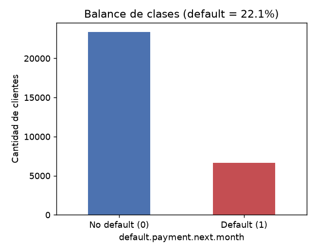
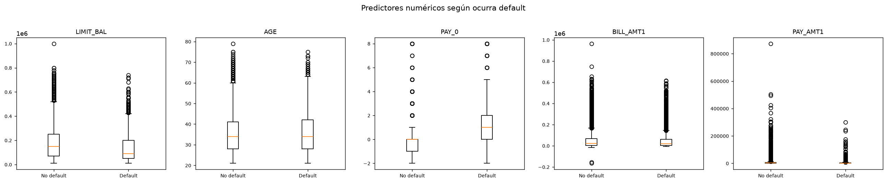
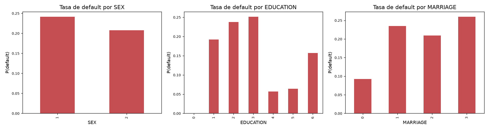
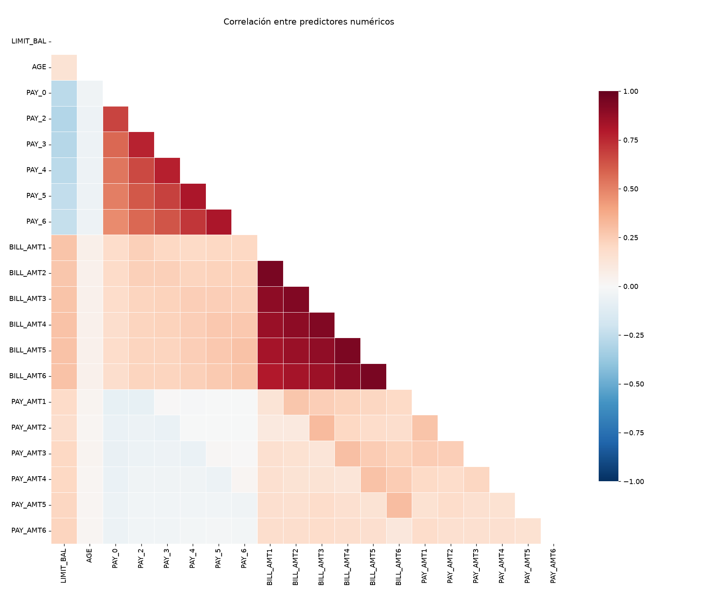
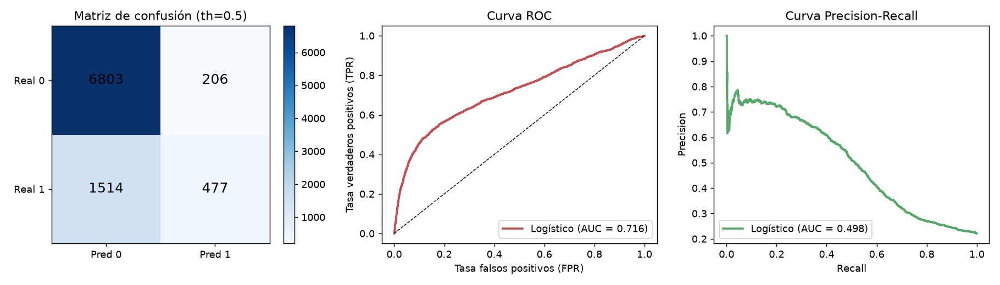

# Informe TP1 — Ejercicio 2: Regresión Logística Multivariable (UCI Credit Card)

**Dataset:** *UCI Credit Card Default* (30 000 clientes, 25 variables).  
**Archivo:** `archive/UCI_Credit_Card.csv`.

---

## Identificación de variables

| Rol | Columnas reales (del CSV) |
|---|---|
| **(a) Respuesta** | `default.payment.next.month` (binaria: 1 = default, 0 = no default). |
| **(b) Numéricas continuas** | `LIMIT_BAL`, `AGE`, `PAY_0`–`PAY_6`, `BILL_AMT1`–`BILL_AMT6`, `PAY_AMT1`–`PAY_AMT6` (20 variables). |
| **(c) Binaria (0/1)** | `SEX` (1 = hombre, 2 = mujer → recodificado a 0/1). |
| **(d) Categóricas > 2 niveles** | `EDUCATION` (1=grad, 2=univ, 3=hs, 4=other), `MARRIAGE` (1=married, 2=single, 3=other). |

A lo largo del informe se usan estos nombres reales.

---

## 1. Análisis exploratorio

### 1.1 Balance de clases

La variable respuesta tiene **22.1 % de defaults** (6636/30 000) y **77.9 % de no-defaults**.
**El dataset está desbalanceado** (razón ≈ 1:3.5).  
**Implicancias:** la accuracy sola es engañosa (un modelo que siempre prediga "no default" ya alcanza 77.9 %). Las métricas adecuadas son **precision, recall, F1, curva ROC y sobre todo Precision-Recall (PR-AUC)**, porque el PR-AUC es sensible a la rareza de la clase positiva.

### 1.2 Exploración visual por clase

**Variables numéricas:**  

Los morosos (default=1) presentan:
- Menor `LIMIT_BAL` (130 k vs 178 k).
- Mayor `PAY_0` (≈ 1 vs −0): mayor retraso en el pago actual.
- Menores `PAY_AMT1` (3.4 k vs 6.3 k): pagan menos del mínimo.

**Variables categóricas (tasa de default por nivel):**  

- `SEX`: hombres (24.2 %) > mujeres (20.8 %).
- `EDUCATION`: "high school" (25.2 %) y "university" (23.7 %) > "graduate" (19.2 %); códigos "other" bajos.
- `MARRIAGE`: "other" (26 %) y "married" (23.5 %) > "single" (20.9 %).

### 1.3 Matriz de correlación

Los predictores **`BILL_AMT1`–`BILL_AMT6`** están **altamente correlacionados** (ρ ≈ 0.94–0.95 mes a mes). Lo mismo ocurre entre `PAY_AMT` consecutivos. Esto indica **multicolinealidad fuerte** entre montos de facturas y pagos consecutivos.

---

## 2. Preparación de datos

Script: `preprocess.py`.

1. **Limpieza inicial:** se descarta `ID`. La respuesta es `default.payment.next.month`.
2. **Recodificación de `SEX`:** binaria 0/1 (0 = hombre, 1 = mujer).
3. **Agrupamiento de códigos raros:**
   - `EDUCATION`: 0, 5, 6, 7 → "other" (referencia = "grad").
   - `MARRIAGE`: 0 → "other" (referencia = "married").
4. **Dummies k−1:** `pd.get_dummies(drop_first=True)` → `EDUCATION_hs`, `EDUCATION_other`, `EDUCATION_univ`; `MARRIAGE_other`, `MARRIAGE_single` (5 dummies).
5. **Estandarización:** `StandardScaler` ajustado solo en train (fórmula 6.6, media 0, σ=1) sobre las 20 numéricas continuas; dummies y binaria no se escalan.
6. **Split estratificado 70/30** (`random_state=42`): **21 000 train / 9 000 test**, manteniendo la tasa de default 22.1 % en ambos.

**Por qué no usar k dummies con intercepto (trampa de la dummy):** con k dummies de una misma categoría, su suma es el vector de unos → colinealidad perfecta con el intercepto (`D₁+…+Dₖ = 1`), `XᵀX` singular. Usar k−1 elimina esa redundancia y cada coeficiente dummy mide el efecto **respecto a la categoría de referencia**.

---

## 3. Ajuste del modelo

Script: `model_logit.py`.

**Método:** regresión logística por **Máxima Verosimilitud** resuelta con **Newton-Raphson** (7 iteraciones, convergió).  
**Función de costo (log-loss / entropía cruzada):**

$$J(\beta) = -\frac{1}{n}\sum_{i=1}^{n}\Big[ y_i \ln(p_i) + (1-y_i)\ln(1-p_i) \Big],\quad
p_i = \frac{1}{1+e^{-(\beta_0+\sum_j \beta_j x_{ij})}}$$

**Resultados del ajuste:**
- Log-likelihood: −9 708.9 | log-loss train: 0.4623
- Pseudo-R² (McFadden): 0.1251

**¿Por qué no OLS?** La respuesta es binaria (0/1); OLS predice valores fuera de [0,1], viola homocedasticidad y normalidad de residuos, y no modela la forma en S de la probabilidad. La logística usa la función sigmoide `p = 1/(1+e⁻ᶻ)` que acota la probabilidad en (0,1) y maximiza la verosimilitud de los 0/1 observados.

---

## 4. Interpretación de coeficientes (Odds Ratios)

Script: `model_logit.py`. Las numéricas están estandarizadas → **OR por +1 desvío estándar**.

| Predictor | β̂ | OR = exp(β̂) | Interpretación |
|---|---|---|---|
| `PAY_0` | +0.654 | **1.92** | +1 ds en retraso actual → **92 % más odds de default** (el predictor más fuerte). |
| `EDUCATION_other` | −1.190 | **0.30** | Educación "other" → 70 % menos odds que "grad". |
| `BILL_AMT1` | −0.321 | **0.73** | Factura mayor → **27 % menos odds** (quizá clientes con alto límite pagan mejor). |
| `PAY_AMT2` | −0.255 | **0.78** | Pago previo mayor → **22 % menos odds**. |
| `MARRIAGE_single` | −0.200 | **0.82** | Soltero → 18 % menos odds que "married". |
| `LIMIT_BAL` | −0.111 | **0.90** | +1 ds en límite → **10 % menos odds**. |
| `SEX` (mujer) | −0.112 | **0.89** | Mujer → 11 % menos odds que hombre. |

**Dummies vs. referencia:**
- `EDUCATION` (ref = *grad*): "hs" OR=0.85, "univ" OR=0.89, "other" OR=0.30.
- `MARRIAGE` (ref = *married*): "single" OR=0.82, "other" OR=0.95.

**Variables que AUMENTAN odds (OR>1):** `PAY_0` (+92 %), `PAY_2/3/4` (~+9–11 %), `BILL_AMT3/4/6` (~+3–4 %), `AGE` (~+4 %).  
**Variables que DISMINUYEN odds (OR<1):** `LIMIT_BAL`, `SEX`, `EDUCATION_univ/hs/other`, `MARRIAGE_single`, `PAY_AMT` (pagos previos altos).

---

## 5. Frontera de decisión y umbral

Script: `evaluacion.py`. Por defecto **threshold = 0.5**.

| Métrica | th = 0.3 | **th = 0.5** | th = 0.7 |
|---|---|---|---|
| Accuracy | 0.801 | **0.809** | 0.786 |
| Precision | 0.562 | **0.698** | 0.735 |
| Recall | **0.456** | 0.240 | 0.050 |
| F1 | **0.503** | 0.357 | 0.094 |

**Matriz de confusión @ 0.5:**
| | Pred 0 | Pred 1 |
|---|---|---|
| Real 0 | 6 803 | 206 |
| Real 1 | 1 514 | 477 |

**Discusión del umbral:**
- **Bajar umbral (p.ej. 0.3):** gana recall (0.456 → atrapa más morosos) a costa de precision (0.562). Conviene si el costo de **falso negativo** (dejar escapar un moroso) es mucho mayor que el de **falso positivo** (rechazar un buen cliente).
- **Subir umbral (p.ej. 0.7):** gana precision (0.735) pero recall cae drásticamente (0.050). Conviene si el costo de **falso positivo** es alto (ej.: perder un buen cliente).

En riesgo crediticio, **no detectar un moroso (FN)** suele costar más que rechazar un buen cliente (FP). Por tanto, **umbral menor a 0.5 (p.ej. 0.3–0.4)** es más razonable.

---

## 6. Evaluación del modelo

Script: `evaluacion.py`.  

| Métrica | Valor |
|---|---|
| **ROC-AUC** | **0.716** |
| **PR-AUC** | **0.498** |
| Log-loss (test) | 0.469 |
| Accuracy (0.5) | 0.809 |
| Precision (0.5) | 0.698 |
| Recall (0.5) | 0.240 |
| F1 (0.5) | 0.357 |

**Curva ROC (AUC = 0.716):** capacidad discriminativa moderada (0.5 = aleatorio, 1 = perfecto).  
**Curva Precision-Recall (AUC = 0.498):** **especialmente relevante** porque la clase positiva (default) es rara (22 %); el PR-AUC penaliza modelos que solo aciertan por predecir la clase mayoritaria. Un AUC-PR cercano a la tasa de positivos (0.221) indicaría un modelo inútil; 0.498 muestra utilidad real.

**Log-loss = 0.469:** mide la calidad de las **probabilidades predichas** (no solo la clase). Penaliza fuertemente predicciones confiadas pero erróneas. Un modelo bien calibrado tiene log-loss bajo; aquí indica que hay margen de mejora en la calibración.

---

## 7. Conclusión y recomendación

**Objetivo del negocio:** en tarjetas de crédito, **no detectar un moroso (falso negativo)** implica pérdida directa del monto adeudado; un **falso positivo** (rechazar buen cliente) implica pérdida de ingresos futuros y molestia, pero suele ser menor. **Priorizar Recall** (minimizar falsos negativos).

**Métrica a priorizar:** **Recall** (y F1 a umbral óptimo). La curva PR muestra que al bajar el umbral a **0.3–0.4** se alcanza **Recall ≈ 0.45–0.50** con F1 ≈ 0.50, un equilibrio aceptable.

**Umbral recomendado:** **0.35** (aproximadamente). En ese punto:
- Recall ≈ 0.43 (atrapar ~43 % de los morosos).
- Precision ≈ 0.55 (la mitad de los alertados son morosos reales).
- F1 ≈ 0.48.

**Resumen:** el modelo logístico (AUC-ROC 0.72, PR-AUC 0.50) tiene capacidad discriminativa útil. Para producción, calibrar el umbral a **0.35** y monitorizar la tasa de falsos positivos; si es excesiva, subir ligeramente. Como mejora futura, probar árboles/ensembles (XGBoost) y *features engineering* sobre `PAY_0`–`PAY_6` (historial de pagos).